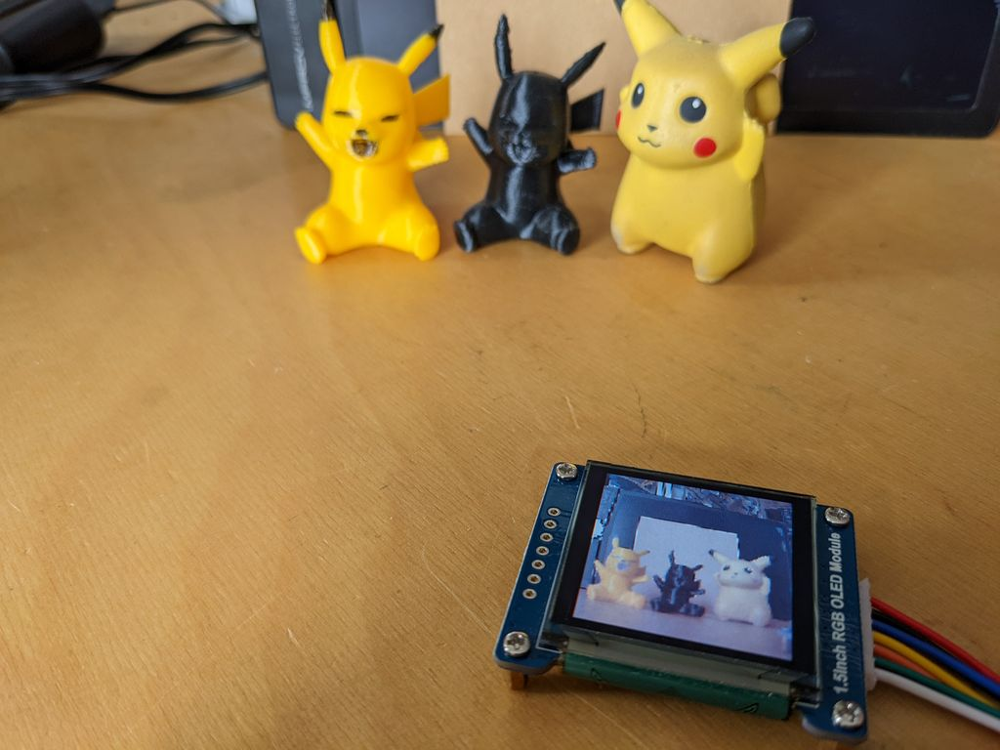

# **PicoCamRgb**

### A Scene for RP2040, Camera, RGB-OLED and three 'Pi-Cach-Yus'

<br>

<br>
Three big legends and their tiny likenesses

<br>

## Links
[-> views](#views)  
[-> source](source)

project with monochrome OLED  
https://github.com/qrti/picoCam

<br>

## Options (Overlay Display)
```
- brightness, contrast
- night vision
- rotate 0-90-180-270 degrees
- vertical-flip, horizontal-flip
- options are stored to flash
```

## Keys
```
- option:    short = next option, double = previous option
- plus:      next value
- minus:     previous value
```

## Remarks
```
- camera OV7725 no fifo version (without RAM on PCB) is used for this project
- if the picture is distorted reduce OLED_SPIFREQ in oled.h 
  or reduce/raise SYS_CLK_DIV in camData.h
- night vision might not switch off properly, reason unknown
- attached python scripts invoke the RP2040 assembler on .pio file changes when compiling
  see platform.ini, pre_script.py and post_script.py
- commented out quart.h is for simple debugging with printf on serial TX (pin 1), RX (pin 2)
```

## Schematic


<br>

## Software Structure
```
           ____ main ____
         /         \      \ 
      cam         oled      keys
     /   \          |        |
camCtrl  camData   text    option

core 0
cam data    -> PIO -> DMA -> line buffer -> video buffer
RGB 565                      480x2 byte     128x128x2 byte
480x480 pix                  1 line         128 lines
    
-> VSYNC IR -> reset line counter
-> HREF IR  -> advance line counter, start DMA
-> 10 ms key polling routine for options

core 1
line buffer       -> video buffer  -> SPI   -> OLED display
128x2 byte       |   128x128x2 byte   30 MHz   128x128 pix RGB
                 |
option overlay ->
```

### Developed and compiled with vsCode, platformIO and wizio-pico
https://code.visualstudio.com/  
https://platformio.org/  
https://github.com/Wiz-IO/wizio-pico  

<br>

---

<br>

## Views

Scene  

<br>
<br>

Display 128x128 Pixel  

<br>
<br>

Rainbow Test Pattern  

<br>
<br>

Options Overlay Display  

<br>
<br>

Top View  

<br>
<br>

Bottom View  

<br>
<br>

<br>
<br>

---

[qrt@qland.de](mailto:qrt@qland.de) 220506
